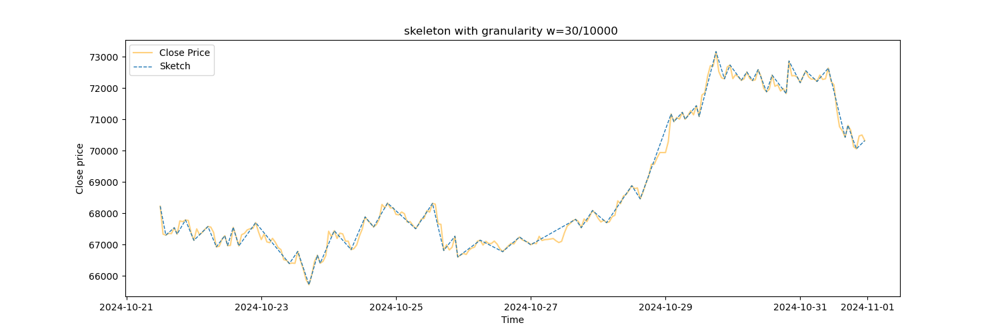
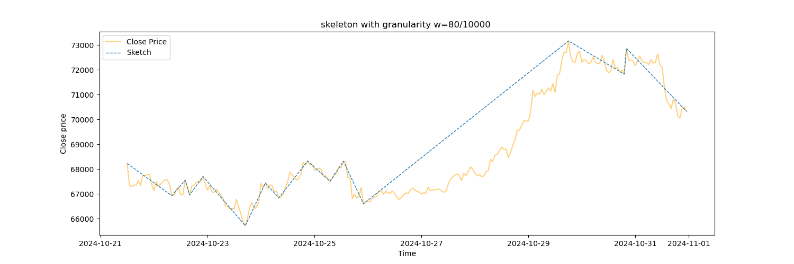
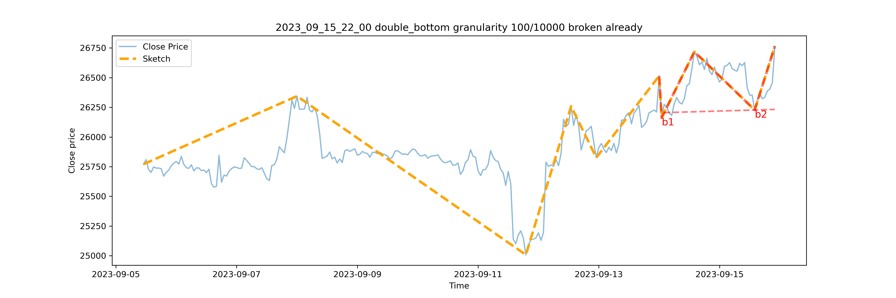
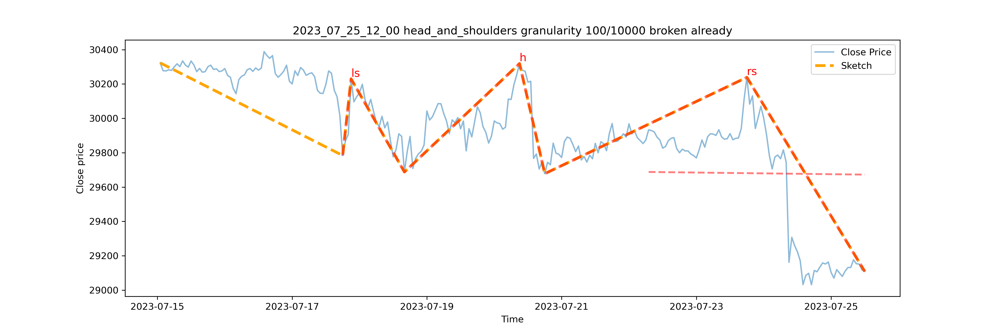

# Chart Pattern Recognition and Trading

This repository contains a chart-pattern recognition system capable of detecting patterns across multiple time granularities, along with automated trading and backtesting functions.

---

## 1. Usage

Run the program from the command line:

```bash
python chart_pattern_trading.py --close close.csv --ticker tickers.csv
```

### 1.1 Data Format Requirements
```close.csv```
- You need to upload a ```close.csv``` which must contain a column named "Date"
- All remaining columns represent tickers. 
- Each row corresponds to the close price of each ticker on that date

```ticker.csv```
- You need to upload a ```ticker.csv``` whcih contain a single column "ticker" listing all ticker names

### 1.2 Scalability 
- The "Date" column logically represents the timestamp of the observation
- Though named “Date”, the system is fully scalable to different time resolutions such as seconds, minutes, hours, days, or weeks, provided your input data matches that resolution

## 2. Sample Images — Price Skeletons
<figure>
  <figcaption><em>high-granularity</em></figcaption>
  
</figure>

<figure>
  <figcaption><em>middle-granularity</em></figcaption>
  
</figure>

<figure>
  <figcaption><em>low-granularity</em></figcaption>
  
</figure>


## 3. Sample Images — Detected Patterns
<figure>
  <figcaption><em>double bottom</em></figcaption>
  
</figure>

<figure>
  <figcaption><em>head and shoulders</em></figcaption>
  
</figure>

## 4. Backtesting Results — 220 Liquid Indian Stocks (5 Years)
<figure>
  <figcaption><em>back testing summary</em></figcaption>
  
</figure>


